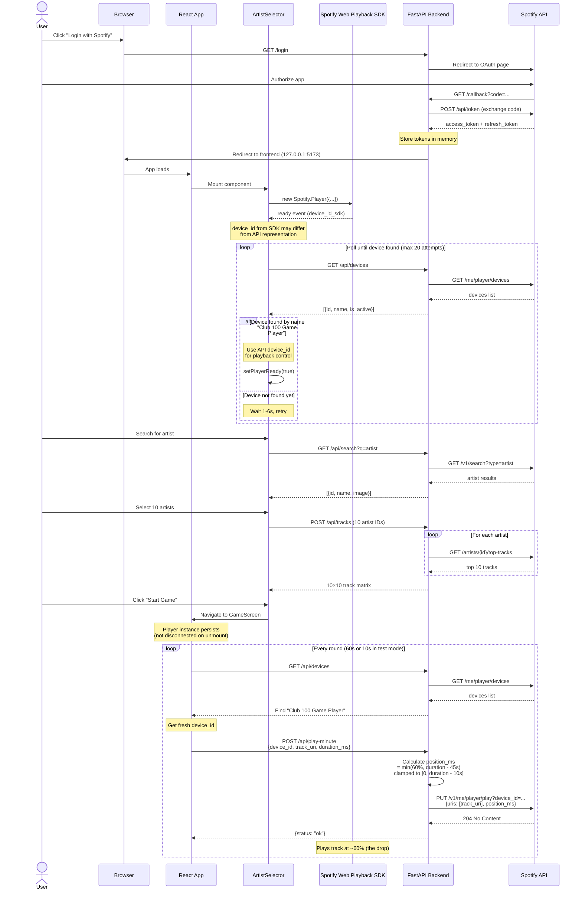

# Spotify Flow Overview

## Visual Sequence Diagram



## Sequence (Happy Path)
1) **Login**: Frontend links to backend `/login` → Spotify auth page → redirect to `/callback`.
2) **Token exchange**: Backend `/callback` saves `access_token` + `refresh_token` in memory. `/api/token` returns a fresh access token (auto-refresh via `get_fresh_token`).
3) **SDK init (frontend)**: `ArtistSelector` waits for `window.Spotify`, creates `Spotify.Player` with `getOAuthToken` calling `/api/token`, connects, and listens for `ready` to get a `device_id`.
4) **Device verify**: `ArtistSelector` polls `/api/devices` until the Web Playback SDK device is registered; passes `deviceId` + `player` up when ready.
5) **Artist selection**: User searches via `/api/search`, picks 10 artists; frontend calls `/api/tracks` to get a 10×10 track matrix.
6) **Game start**: `GameScreen` starts timer; for each round, calls `/api/play-minute` with `device_id`, `track_uri`, and `duration_ms`.
7) **Playback control (backend)**: `/api/play-minute` clamps `position_ms` (~60% drop, min 10s left) and PUTs to Spotify `/v1/me/player/play?device_id=...`.

## Key Components & Files
- **Backend**  
  - Routes: `backend/app.py` (`/login`, `/callback`, `/api/token`, `/api/search`, `/api/tracks`, `/api/play-minute`, `/api/devices`)  
  - Spotify client/helpers: `backend/spotify.py` (auth URLs, token refresh, search, top tracks, playback)
- **Frontend**  
  - SDK load: `frontend/index.html` includes `<script src="https://sdk.scdn.co/spotify-player.js">`  
  - Player init + device verify: `frontend/src/components/ArtistSelector.jsx`  
  - Timer & playback loop: `frontend/src/components/GameScreen.jsx`  
  - API client: `frontend/src/api.js`

## Device ID Lifecycle & The Mismatch Problem

### The Issue
The Web Playback SDK and Spotify's backend API use **different device ID formats** for the same device:

- **SDK `ready` event**: Returns `device_id_sdk` (e.g., `ec1da88a6ec4dd04ec05842d4eb64059029cda99`)
- **API `/me/player/devices`**: Returns `device_id_api` (e.g., `3af7b37729fa262a85d420893862f9c60c598932`)

These IDs represent the **same physical device** but in different representations.

### The Solution
**Match by device name** instead of ID:

1. SDK reports `ready` with `device_id_sdk`
2. Poll `/api/devices` until a device with name `"Club 100 Game Player"` appears
3. Extract the `device_id_api` from the matched device
4. Use `device_id_api` for all playback control calls

### Registration Delay
The SDK reports "ready" **locally in the browser** immediately, but it takes **10-30 seconds** for Spotify's backend servers to register the device. During this window:

- SDK says device is ready ✓
- `/api/devices` returns empty list or doesn't include our device ✗
- Playback commands return `404 Device Not Found` ✗

**Fix**: Active polling with exponential backoff (1.5s → 6s max, 20 attempts).

### Player Persistence Across Screens
**Critical**: The player instance must **not** be disconnected when `ArtistSelector` unmounts:

```javascript
// ❌ WRONG - destroys device when navigating to GameScreen
return () => {
  if (playerRef.current) {
    playerRef.current.disconnect(); // Device disappears!
  }
};

// ✓ CORRECT - keep player alive
return () => {}; // No cleanup
```

The `GameScreen` needs the same player instance to control playback.

## Error Handling & Edge Cases

### 404 Device Not Found
**Cause**: Device ID not recognized by Spotify's API
**Solutions**:
1. Wait longer for device registration (increase polling timeout)
2. Fetch fresh device ID before each playback call (current implementation)
3. Verify device exists in `/api/devices` before starting game

### 403 Forbidden
**Cause**: Account doesn't have Spotify Premium
**Solution**: Show error message, Premium is required for Web Playback SDK

### 429 Rate Limit
**Cause**: Too many API requests
**Solution**: Exponential backoff (implemented in device polling)

### Token Expired
**Cause**: Access token expired (1 hour lifetime)
**Solution**: Backend auto-refreshes via `get_fresh_token()` using refresh token

### Track Unavailable
**Cause**: Track not playable in user's market or artist has < 10 tracks
**Solution**: Backend pads track matrix with `null`, frontend handles gracefully

### Player Disconnected Mid-Game
**Cause**: Network issues, user closed Spotify, device went offline
**Detection**: `not_ready` event from SDK
**Solution**: Pause game, show reconnect modal (not yet implemented in Phase 9)

## Notes & Constraints
- Spotify Web Playback SDK requires Premium and an active device.
- Device registration lags: poll `/api/devices` ~20–40s if needed.
- Tokens stored in-memory; restart requires re-auth.
- `position_ms` is clamped to `[0, duration_ms - 10000]` and respects the 60%/−45s rule for drops.
- Device IDs from SDK and API are different representations - always match by name.
- Player must persist across component unmounts to maintain playback control.***
